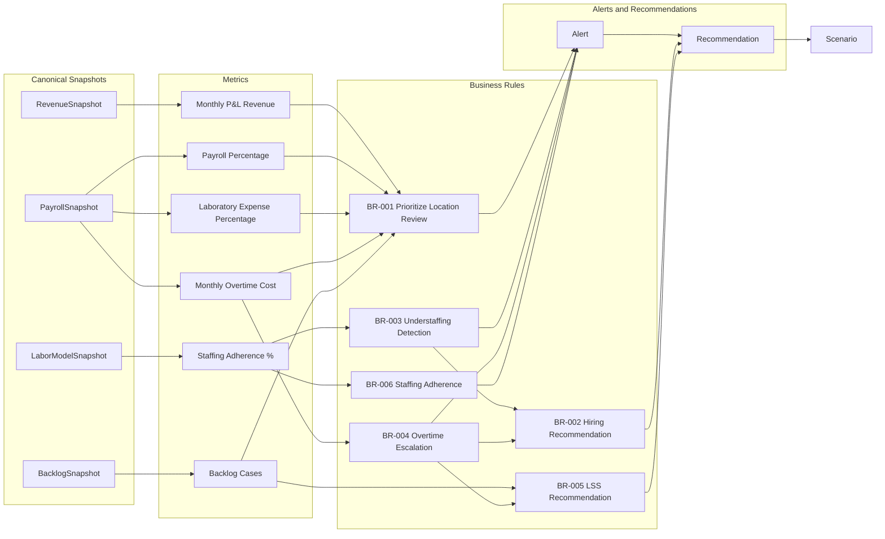
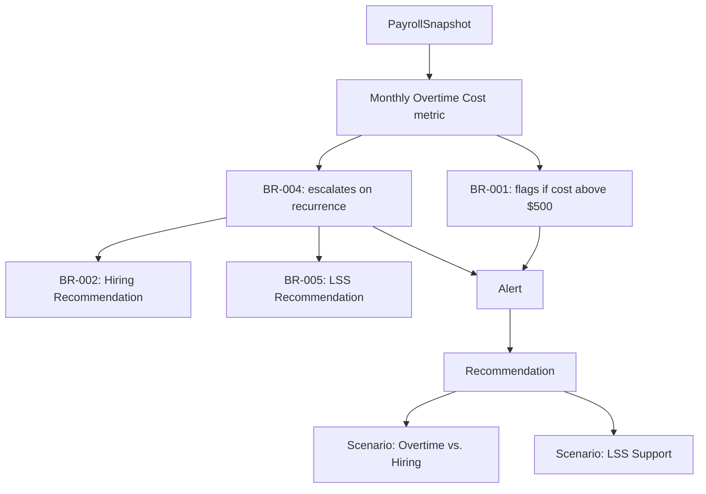

# Decision Graph

**Version:** 0.1
**Status:** Discovery / Platform Design
**Owner:** Engineering / Lab Operations
**Last Updated:** 2026-08-04

## Purpose

Show, at a glance, how canonical metrics flow into business rules, and how business rules flow into alerts and recommendations. This is a map of relationships already documented elsewhere ([`docs/data/01-metrics-dictionary.md`](../data/01-metrics-dictionary.md), [`docs/business/rules/`](../business/rules/)) — it does not introduce new thresholds, formulas, or scoring logic.

## Overview

## Reading the Graph

- **Snapshots feed metrics.** Each canonical snapshot (see [`docs/entities/`](../entities/)) is the source for one or more metrics defined in [`docs/data/01-metrics-dictionary.md`](../data/01-metrics-dictionary.md).
- **Metrics feed rules, not the other way around.** A metric does not know which rules consume it; rules depend on metrics, never the reverse. This keeps metrics reusable across current and future rules.
- **Rules can feed other rules.** [BR-003](../business/rules/BR-003-understaffing-detection.md) (Understaffing Detection) and [BR-004](../business/rules/BR-004-overtime-escalation.md) (Overtime Escalation) are detection/escalation rules that feed [BR-002](../business/rules/BR-002-hiring-recommendation.md) (Hiring Recommendation) and [BR-005](../business/rules/BR-005-lss-recommendation.md) (LSS Recommendation), which are recommendation rules. This mirrors the distinction already drawn in those documents between detection and recommendation.
- **Rules produce Alerts; recommendation rules produce Recommendations directly.** [BR-001](../business/rules/BR-001-prioritize-location-review.md), [BR-003](../business/rules/BR-003-understaffing-detection.md), [BR-004](../business/rules/BR-004-overtime-escalation.md), and [BR-006](../business/rules/BR-006-staffing-adherence.md) primarily raise Alerts for review; [BR-002](../business/rules/BR-002-hiring-recommendation.md) and [BR-005](../business/rules/BR-005-lss-recommendation.md) primarily synthesize Alerts and other rule outputs into Recommendations, per the [Recommendation Framework](recommendation-framework.md).
- **Recommendations point to Scenarios.** A Recommendation's suggested next step is typically a [Scenario](../entities/scenario.md) (see [`docs/scenario-engine/README.md`](../scenario-engine/README.md)) where the manager models the specific action before deciding.

## Detail: Overtime Path

A more detailed view of one path through the graph, since overtime is the clearest example of detection feeding escalation feeding recommendation:

This detail view shows why BR-004 exists as its own rule rather than folding into BR-001: the same underlying metric (Monthly Overtime Cost) supports both a simple threshold flag (BR-001) and a recurrence-aware escalation (BR-004) that in turn informs two different recommendation types.

## What This Graph Does Not Show

- Numeric thresholds or formulas (see [`docs/data/01-metrics-dictionary.md`](../data/01-metrics-dictionary.md) and individual business-rule documents for what is and is not yet approved).
- Timing or scheduling of when rules evaluate (a future architecture concern).
- UI layout of alerts, recommendations, or scenarios.

## Related Documents

- [ADR-005: Canonical Data Model](../decisions/ADR-005-canonical-data-model.md)
- [Canonical Data Principles](canonical-data-principles.md)
- [Recommendation Framework](recommendation-framework.md)
- [Entity Catalog](../entities/)
- [Business Rules](../business/rules/)
- [Metrics Dictionary](../data/01-metrics-dictionary.md)
- [Open Questions](../development/open-questions.md)
