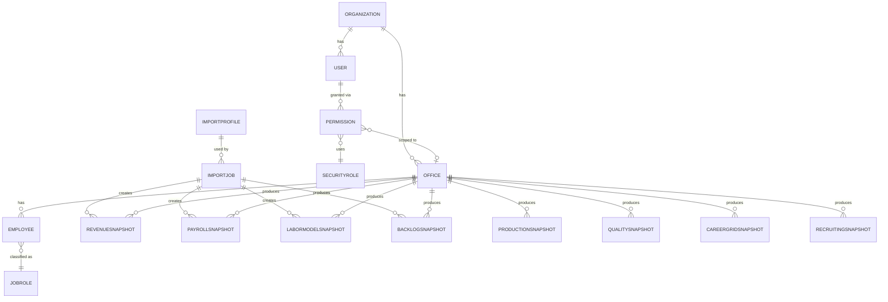
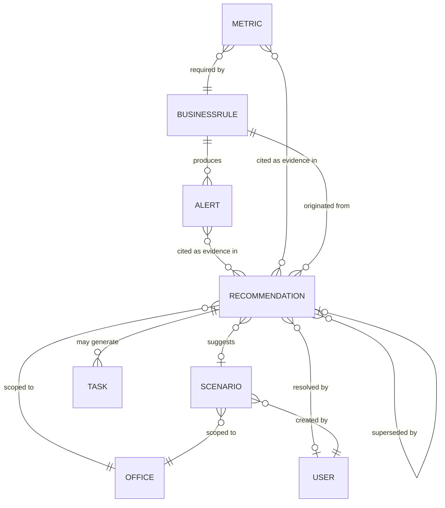

# Conceptual ERD

**Version:** 0.1
**Status:** Discovery / Data Platform Design — conceptual only, no SQL
**Owner:** Engineering
**Last Updated:** 2026-08-04

## Purpose

Provide a visual, conceptual entity-relationship diagram of LabPulse's canonical data model, complementing the prose in [`docs/data-model/relationship-catalog.md`](../data-model/relationship-catalog.md). **This is not a database schema.** No column types, primary keys, or foreign keys are implied — entity names and relationship lines only, matching [ADR-005](../decisions/ADR-005-canonical-data-model.md) and [ADR-006](../decisions/ADR-006-data-platform-philosophy.md)'s instruction that logical models precede databases.

## Diagram 1: Tenancy, Authorization, and Snapshots

**Notes:** ProductionSnapshot, QualitySnapshot, CareerGridSnapshot, and RecruitingSnapshot are shown without an ImportJob link because no Import Profile has been analyzed for their source systems yet (see [`docs/data-model/snapshot-strategy.md`](../data-model/snapshot-strategy.md)) — conceptually they will gain the same ImportJob relationship once one exists.

## Diagram 2: Business Rules, Scenarios, and Recommendations

**Notes:** `RECOMMENDATION }o--o| RECOMMENDATION : "superseded by"` is a self-referencing relationship, representing the Supersession pattern from [`docs/data-model/01-entity-relationships.md`](../data-model/01-entity-relationships.md) — a Recommendation optionally points to exactly one newer Recommendation that replaced it. "Evidence" (see [`docs/data-model/recommendation-persistence.md`](../data-model/recommendation-persistence.md)) is represented here as direct Alert/Metric-to-Recommendation relationships rather than as its own entity, consistent with [`relationship-catalog.md`](../data-model/relationship-catalog.md)'s note that Evidence is a reference collection, not a standalone entity.

## Reading Cardinality Notation

Standard Mermaid ER notation is used:

- `||` — exactly one
- `o{` — zero or many
- `o|` — zero or one
- `}o` — many (optional)

For example, `RECOMMENDATION }o--o| SCENARIO : suggests` reads: many Recommendations may each optionally suggest zero or one Scenario.

## Why Two Diagrams Instead of One

A single diagram covering all ~24 entities and every relationship in [`relationship-catalog.md`](../data-model/relationship-catalog.md) would be unreadable. Splitting along the same seam as [`docs/architecture/domain-boundaries.md`](domain-boundaries.md) (tenancy/imports/snapshots vs. business-rules/scenarios/recommendations) keeps each diagram legible, per the same "prefer clarity" guidance already applied in [`docs/architecture/decision-graph.md`](decision-graph.md).

## What This Document Does Not Define

- Column types, primary keys, foreign keys, or indexes.
- Exact cardinality where it remains genuinely undecided (for example, whether a Recommendation can ever cite zero Alerts — likely no, but not yet confirmed).
- Physical table or schema design (Sprint 3 scope).

## Related Documents

- [Relationship Catalog](../data-model/relationship-catalog.md)
- [Entity Relationships: Framework](../data-model/01-entity-relationships.md)
- [Domain Boundaries](domain-boundaries.md)
- [Decision Graph](decision-graph.md)
- [Entity Catalog](../entities/README.md)
- [ADR-005: Canonical Data Model](../decisions/ADR-005-canonical-data-model.md)
