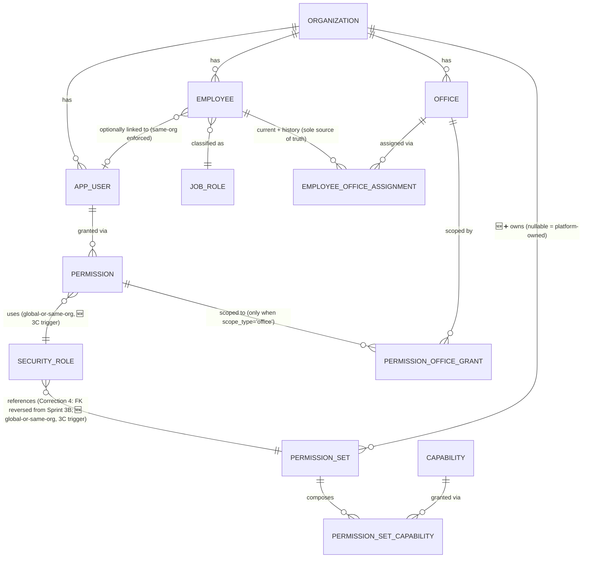
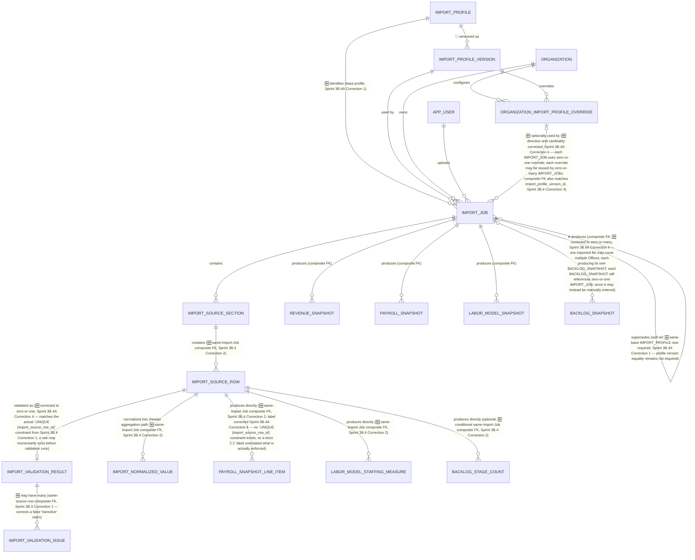
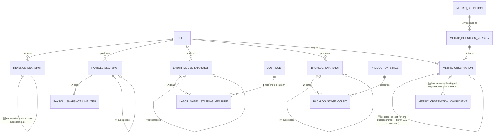
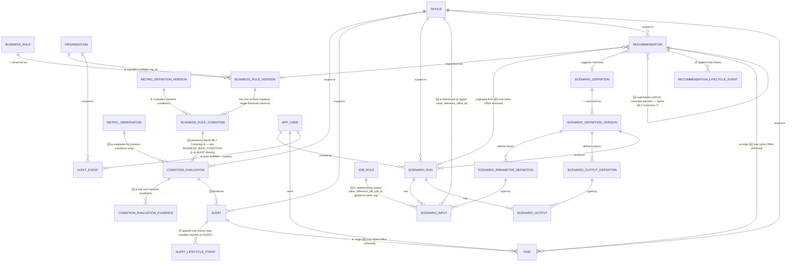

# Proposed Physical ERD

**Version:** 0.5 (Sprint 3B.4A corrections applied — see [`docs/development/SPRINT_3B_4A_FINAL_RECONCILIATION.md`](../development/SPRINT_3B_4A_FINAL_RECONCILIATION.md); Sprint 3B.1, 3B.2, 3B.3, and 3B.4 corrections also applied)
**Status:** Proposed — companion to [ADR-007](../decisions/ADR-007-proposed-physical-data-model.md); no SQL implied beyond what is documented in [`docs/database/`](../database/)
**Owner:** Engineering
**Last Updated:** 2026-08-06

## Purpose

Visualize the proposed physical schema described in [`docs/database/`](../database/), extending the conceptual [`erd-concept.md`](erd-concept.md) with keys, cardinality, and MVP/deferred status. Split into five sections: the four required coverage areas, plus a fifth section showing join/link tables as explicit boxes rather than annotated direct lines, per Sprint 3B.1 Correction 14 — a physically accurate diagram must show the actual tables PostgreSQL will create, not a shorthand that only mentions them in a note.

**Legend used in diagram notes:** 🟢 MVP table · ⚪ Deferred (no table created) · 🔷 Version table · 📋 Header/detail pair · ➕ Optional relationship

## Section 1: Organization, Identity, and Authorization

**Notes:**

- 🟢 Every table shown is MVP.
- `EMPLOYEE }o--o| APP_USER` is deliberately optional in both directions — an Employee need not be a User, and a User need not be an Employee. The composite FK `(organization_id, linked_app_user_id) → app_user (organization_id, id)` (Correction 2/10) is not itself drawable as a Mermaid cardinality symbol, so it is called out here in prose instead.
- **`employee.office_id` no longer exists (Correction 10).** An Employee's current Office is derived from its `EMPLOYEE_OFFICE_ASSIGNMENT` row with no end date — there is deliberately no direct `EMPLOYEE ||--|| OFFICE` line in this diagram.
- **`PERMISSION_OFFICE_GRANT` having zero rows no longer means organization-wide access (Correction 3).** Organization-wide access is recognized only when `PERMISSION.scope_type = 'organization'`; a `PERMISSION_OFFICE_GRANT` row can only exist for a Permission whose `scope_type = 'office'` (enforced by a composite FK from the grant to `permission (id, scope_type)`, not shown as a separate diagram element).
- **`SECURITY_ROLE ||--|| PERMISSION_SET` from Sprint 3B has been reversed and re-cardinalized (Correction 4):** the foreign key now lives on `SECURITY_ROLE` (`permission_set_id`), so multiple Security Roles can reference the same Permission Set without a schema change — shown here as `}o--||` (many roles, optionally, to one Permission Set) rather than a strict `||--||`.
- **🆕 `ORGANIZATION ||--o{ PERMISSION_SET` (Sprint 3B.2 Correction 3):** `permission_set.organization_id` is nullable — `NULL` means platform-owned and immutable, a real value means organization-owned. A global `SECURITY_ROLE` may reference only a global `PERMISSION_SET`; an organization-scoped `SECURITY_ROLE` may reference a same-organization `PERMISSION_SET` or an intentional global one — never another organization's. This is a **conditional** rule a plain FK cannot express; both `PERMISSION → SECURITY_ROLE` and `SECURITY_ROLE → PERMISSION_SET` require a Sprint 3C trigger (marked 🆕 above), per [`docs/database/01-physical-model-principles.md`](../database/01-physical-model-principles.md) "Global-or-Same-Organization Reference Pattern."
- `OFFICE.region` is not shown as a relationship to any authorization table — it is a plain column on `OFFICE`, deliberately absent from this diagram's authorization chain, per [ADR-004](../decisions/ADR-004-office-based-authorization.md).
- `SECURITY_ROLE` rows with `organization_id IS NULL` are the three MVP-default roles (Organization Administrator, Operations Manager, Read-Only Viewer); an organization-scoped row represents a future, not-yet-seeded custom role.

## Section 2: Imports and Lineage

**Notes:**

- 🟢 Every table shown is MVP.
- `IMPORT_JOB ||--o{ IMPORT_JOB : "supersedes"` is the Supersession pattern applied to reprocessing — a self-referencing, optional relationship (➕). **Sprint 3B.4A Correction 1** strengthens this from a same-Organization-only match to also require the same base `IMPORT_PROFILE` (an unrelated profile type, e.g. Payroll superseding Labor Model, can no longer enter the same chain); a newer Profile *Version* within that same profile remains explicitly permitted.
- **🆕 `IMPORT_PROFILE → IMPORT_JOB` (Sprint 3B.4A Correction 1):** a new, direct identity relationship alongside the existing `IMPORT_PROFILE_VERSION → IMPORT_JOB`, added specifically so an Import Job's base profile — independent of which version — can be compared against its supersession predecessor's base profile.
- **`IMPORT_JOB → {REVENUE,PAYROLL,LABOR_MODEL,BACKLOG}_SNAPSHOT` (Sprint 3B.3 Correction 3):** a same-organization composite FK. `BACKLOG_SNAPSHOT`'s relationship is additionally optional on the `IMPORT_JOB` side (`o|`, since a Backlog Snapshot may instead be manually entered — `manual_entry_user_id` populated, `import_job_id` null, enforced by a genuine same-row `CHECK`, not merely documentation convention) **and, corrected in Sprint 3B.4A Correction 4, zero-or-many on the `BACKLOG_SNAPSHOT` side (`o{`)**, since one imported file may contain data for multiple Offices, each producing its own Backlog Snapshot from the same Import Job — the Sprint 3B/3B.1–3B.4 diagrams incorrectly limited this to zero-or-one. The duplicated `import_profile_version_id` fact previously stored independently on `REVENUE_SNAPSHOT`/`PAYROLL_SNAPSHOT`/`LABOR_MODEL_SNAPSHOT` was removed by Sprint 3B.3 Correction 3 — it is derived exclusively through this relationship (`→ import_job.import_profile_version_id`).
- **The Sprint 3B "soft ref" from `IMPORT_NORMALIZED_VALUE` to the four snapshot header tables is gone (Correction 7).** `IMPORT_NORMALIZED_VALUE` no longer has any target column at all; instead, four typed link tables (shown in Section 5) connect it to whichever header snapshot it feeds, created only once that header row exists.
- **Detail rows bypass `IMPORT_NORMALIZED_VALUE` entirely (Correction 7):** `PAYROLL_SNAPSHOT_LINE_ITEM`, `LABOR_MODEL_STAFFING_MEASURE`, and `BACKLOG_STAGE_COUNT` each carry a direct `import_source_row_id` foreign key, since each is produced by exactly one source row — shown here as direct lines from `IMPORT_SOURCE_ROW`.
- **🆕 Sprint 3B.4 — Import-Job-level enforcement, not merely Organization-level.** Most relationships marked 🆕 in this section's diagram previously enforced only that the two ends shared an Organization; each now also requires the two ends to share the exact same producing `IMPORT_JOB`, closing a gap where two rows from two different Import Jobs (within the same Organization) could otherwise have been connected. `BACKLOG_STAGE_COUNT`'s two relationships are marked **conditional** because a manually-entered stage count has no Import Job at all (`MATCH SIMPLE` foreign-key semantics skip the check when the column is `NULL`, which is the correct, deliberate behavior for that case) — see [`docs/database/06-import-lineage-model.md`](../database/06-import-lineage-model.md) "Import-Provenance Integrity Matrix" for the complete, per-relationship statement of exactly what is and is not enforced, and one honest residual gap (a manual stage count's header must also be manual) left as a named Sprint 3C trigger rather than silently unaddressed.
- **🆕 markers added in Sprint 3B.4A cover a different concern — cardinality and identity corrections, not Import-Job enforcement:** the `IMPORT_PROFILE → IMPORT_JOB` relationship, the `IMPORT_JOB`-supersession same-base-Profile requirement, the `IMPORT_SOURCE_ROW → IMPORT_VALIDATION_RESULT` cardinality fix (zero-or-many corrected to zero-or-one), the `PAYROLL_SNAPSHOT_LINE_ITEM` label correction, the `IMPORT_JOB ↔ BACKLOG_SNAPSHOT` cardinality fix, and the `ORGANIZATION_IMPORT_PROFILE_OVERRIDE ↔ IMPORT_JOB` direction/cardinality fix are all Sprint 3B.4A corrections to previously-inaccurate diagram claims, not new database enforcement — see each relationship's own label above for its specific fix.
- No box in this diagram represents raw file *content* — `IMPORT_JOB.source_file_storage_path` is a reference to server-controlled storage, not a database-stored blob.

## Section 3: Snapshots and Metrics

**Notes:**

- 🟢 `REVENUE_SNAPSHOT`, `PAYROLL_SNAPSHOT` (📋), `LABOR_MODEL_SNAPSHOT` (📋), `BACKLOG_SNAPSHOT` (📋), `PRODUCTION_STAGE`, `METRIC_DEFINITION`/`METRIC_DEFINITION_VERSION` (🔷), `METRIC_OBSERVATION`, `METRIC_OBSERVATION_COMPONENT` are all MVP.
- ⚪ **`ProductionSnapshot`, `QualitySnapshot`, `CareerGridSnapshot`, and `RecruitingSnapshot` are deliberately absent from this diagram** — no box, no table, no placeholder column. See [`docs/database/09-deferred-entities.md`](../database/09-deferred-entities.md).
- **🆕 Self-referencing "supersedes" relationships (Correction 1)** on all four snapshot header tables are new since Sprint 3B — each is a same-organization composite FK, `||--o|` (zero or one successor).
- **🆕 `METRIC_OBSERVATION_COMPONENT` replaces Sprint 3B's four `METRIC_OBSERVATION_*_SNAPSHOT` typed join tables.** Its own typed, nullable snapshot references are shown in Section 5, since a component may cite any one of the four snapshot types (or none, if it is not snapshot-derived); each reference is now organization-**and**-office matched (Sprint 3B.2 Correction 2).
- **🆕 `METRIC_OBSERVATION`'s self-referencing "supersedes" relationship (Sprint 3B.2 Correction 1)** mirrors the four snapshot tables' pattern exactly — `evaluation_fingerprint`, `revision_number`, `supersedes_metric_observation_id` — correcting a Sprint 3B.1 uniqueness constraint that blocked a legitimate re-evaluation after a source snapshot correction. See [`docs/database/04-keys-relationships-and-constraints.md`](../database/04-keys-relationships-and-constraints.md) "Metric Observation Identity and Reuse."
- `LABOR_MODEL_STAFFING_MEASURE`'s relationship to `JOB_ROLE` is optional (➕) — populated only when `unit_type = 'role_broken_out'`.
- `BACKLOG_SNAPSHOT`'s total is no longer a single column — see [`docs/database/03-column-and-type-catalog.md`](../database/03-column-and-type-catalog.md) for `source_provided_total_case_count`/`derived_total_case_count`/`displayed_total_basis`/`total_discrepancy_amount` (Correction 9), not separately diagrammed as relationships since they are plain columns, not references.

## Section 4: Rules, Scenarios, Recommendations, and Audit

**Notes:**

- 🟢 All tables shown are MVP, including the two new Sprint 3B.2 tables `CONDITION_EVALUATION` and `CONDITION_EVALUATION_EVIDENCE`. `TASK_STATUS_HISTORY` from Sprint 3B's diagram remains **removed entirely (Correction 13)** — it is deferred, not drawn even as an optional MVP relationship; see [`docs/database/09-deferred-entities.md`](../database/09-deferred-entities.md).
- **🆕 `CONDITION_EVALUATION` now sits between `BUSINESS_RULE_CONDITION` and `ALERT` (Sprint 3B.2 Correction 6), replacing Sprint 3B.1's direct `BUSINESS_RULE_CONDITION ||--o{ ALERT` line.** Sprint 3B.1's `ALERT` required a Metric Observation unconditionally, which cannot represent `qualitative`/`missing_data`/`stale_data`/`other` conditions. `CONDITION_EVALUATION`'s relationship to `METRIC_OBSERVATION` is optional (➕) for exactly this reason — populated only for `numeric` conditions. `ALERT` itself is now a thin pointer at its `CONDITION_EVALUATION`, carrying only `organization_id`, `office_id`, `condition_evaluation_id`, `triggered_at`.
- **`ALERT_LIFECYCLE_EVENT` (Sprint 3B.1 Correction 8)** — `ALERT`'s current lifecycle state is **not** a column on `ALERT`; it is always derived from the latest `ALERT_LIFECYCLE_EVENT` row by `sequence_number`, the same pattern already used for `RECOMMENDATION`. Unaffected by the `CONDITION_EVALUATION` change above.
- **`SCENARIO_PARAMETER_DEFINITION`/`SCENARIO_OUTPUT_DEFINITION` (Correction 11)** — `SCENARIO_INPUT`/`SCENARIO_OUTPUT` reference these definitions instead of carrying a free-text key; typed value columns and their `CHECK` are documented in [`docs/database/03-column-and-type-catalog.md`](../database/03-column-and-type-catalog.md), not separately diagrammable as a relationship.
- **🆕 Scenario value/definition version binding (Sprint 3B.3 Correction 4)** — not separately diagrammable, since it strengthens the *enforcement* of the two relationships already shown (`SCENARIO_RUN ||--o{ SCENARIO_INPUT`/`SCENARIO_OUTPUT` and `SCENARIO_PARAMETER_DEFINITION`/`SCENARIO_OUTPUT_DEFINITION ||--o{ SCENARIO_INPUT`/`SCENARIO_OUTPUT`) rather than adding a new one. `SCENARIO_INPUT`/`SCENARIO_OUTPUT` now each carry a `scenario_definition_version_id` composite-FK-bound both to their parent Run's own version and to the cited definition's owning version, closing a gap where a value could previously have cited a definition from a *different* Scenario Definition Version than the one its Run actually used. See [`docs/database/04-keys-relationships-and-constraints.md`](../database/04-keys-relationships-and-constraints.md) "Binding Scenario Values to the Run's Exact Definition Version."
- **🆕 `JOB_ROLE`/`OFFICE` referenced by `SCENARIO_INPUT` (Sprint 3B.2 Correction 9)** replace Sprint 3B.1's single, unenforceable generic `value_reference_id` — the only two reference target types with concrete precedent anywhere in this repository. `SCENARIO_OUTPUT` has the identical, un-diagrammed pair for brevity.
- **🆕 `RECOMMENDATION` self-reference, direction corrected (Sprint 3B.2 Correction 7):** `supersedes_recommendation_id` now lives on the newer row, pointing backward — Sprint 3B.1's `superseded_by_recommendation_id` required mutating the older, already-immutable row.
- The four `SCENARIO_RUN → *_SNAPSHOT` "baseline" relationships and the two `RECOMMENDATION → ALERT`/`METRIC_OBSERVATION` "evidence" relationships are typed join tables — shown explicitly as boxes in Section 5, not as annotated direct lines, per Correction 14.
- `AUDIT_EVENT`'s relationship to "any entity" is intentionally **not diagrammed as a relationship line** to every other box — it uses a soft `entity_type`/`entity_id` pair with no enforced FK, the one deliberate exception explained in [`docs/database/04-keys-relationships-and-constraints.md`](../database/04-keys-relationships-and-constraints.md).

## Section 5: Join and Link Table Detail (New — Sprint 3B.1 Correction 14)

Sprint 3B's diagram drew several typed many-to-many and header-aggregation relationships as direct lines annotated "(typed join)," without showing the join table itself as a box. That is readable but not physically accurate — PostgreSQL will create a real table for each of these. This section shows them explicitly.

```mermaid
erDiagram
    RECOMMENDATION ||--o{ RECOMMENDATION_EVIDENCE_ALERT : cites
    ALERT ||--o{ RECOMMENDATION_EVIDENCE_ALERT : "cited by"
    RECOMMENDATION ||--o{ RECOMMENDATION_EVIDENCE_METRIC_OBSERVATION : cites
    METRIC_OBSERVATION ||--o{ RECOMMENDATION_EVIDENCE_METRIC_OBSERVATION : "cited by"

    SCENARIO_RUN ||--o{ SCENARIO_RUN_REVENUE_SNAPSHOT : baselines
    REVENUE_SNAPSHOT ||--o{ SCENARIO_RUN_REVENUE_SNAPSHOT : "used as baseline by"
    SCENARIO_RUN ||--o{ SCENARIO_RUN_PAYROLL_SNAPSHOT : baselines
    PAYROLL_SNAPSHOT ||--o{ SCENARIO_RUN_PAYROLL_SNAPSHOT : "used as baseline by"
    SCENARIO_RUN ||--o{ SCENARIO_RUN_LABOR_MODEL_SNAPSHOT : baselines
    LABOR_MODEL_SNAPSHOT ||--o{ SCENARIO_RUN_LABOR_MODEL_SNAPSHOT : "used as baseline by"
    SCENARIO_RUN ||--o{ SCENARIO_RUN_BACKLOG_SNAPSHOT : baselines
    BACKLOG_SNAPSHOT ||--o{ SCENARIO_RUN_BACKLOG_SNAPSHOT : "used as baseline by"

    METRIC_OBSERVATION_COMPONENT }o--o| REVENUE_SNAPSHOT : "🆕 optionally sourced from"
    METRIC_OBSERVATION_COMPONENT }o--o| PAYROLL_SNAPSHOT : "🆕 optionally sourced from"
    METRIC_OBSERVATION_COMPONENT }o--o| LABOR_MODEL_SNAPSHOT : "🆕 optionally sourced from"
    METRIC_OBSERVATION_COMPONENT }o--o| BACKLOG_SNAPSHOT : "🆕 optionally sourced from"

    IMPORT_NORMALIZED_VALUE ||--o{ IMPORT_NORMALIZED_VALUE_REVENUE_SNAPSHOT : "links (post-creation; 🆕 same-Import-Job, Sprint 3B.4 Correction 2)"
    REVENUE_SNAPSHOT ||--o{ IMPORT_NORMALIZED_VALUE_REVENUE_SNAPSHOT : "target of (🆕 same-Import-Job)"
    IMPORT_NORMALIZED_VALUE ||--o{ IMPORT_NORMALIZED_VALUE_PAYROLL_SNAPSHOT : "links (🆕 same-Import-Job)"
    PAYROLL_SNAPSHOT ||--o{ IMPORT_NORMALIZED_VALUE_PAYROLL_SNAPSHOT : "target of (🆕 same-Import-Job)"
    IMPORT_NORMALIZED_VALUE ||--o{ IMPORT_NORMALIZED_VALUE_LABOR_MODEL_SNAPSHOT : "links (🆕 same-Import-Job)"
    LABOR_MODEL_SNAPSHOT ||--o{ IMPORT_NORMALIZED_VALUE_LABOR_MODEL_SNAPSHOT : "target of (🆕 same-Import-Job)"
    IMPORT_NORMALIZED_VALUE ||--o{ IMPORT_NORMALIZED_VALUE_BACKLOG_SNAPSHOT : "links (🆕 same-Import-Job)"
    BACKLOG_SNAPSHOT ||--o{ IMPORT_NORMALIZED_VALUE_BACKLOG_SNAPSHOT : "target of (🆕 same-Import-Job)"

    CONDITION_EVALUATION ||--o{ CONDITION_EVALUATION_EVIDENCE : "🆕 has (non-numeric condition evidence)"
    IMPORT_JOB ||--o{ CONDITION_EVALUATION_EVIDENCE : "🆕 ➕ optionally cited by"
    REVENUE_SNAPSHOT ||--o{ CONDITION_EVALUATION_EVIDENCE : "🆕 ➕ optionally cited by"
    PAYROLL_SNAPSHOT ||--o{ CONDITION_EVALUATION_EVIDENCE : "🆕 ➕ optionally cited by"
    LABOR_MODEL_SNAPSHOT ||--o{ CONDITION_EVALUATION_EVIDENCE : "🆕 ➕ optionally cited by"
    BACKLOG_SNAPSHOT ||--o{ CONDITION_EVALUATION_EVIDENCE : "🆕 ➕ optionally cited by"
```

**Notes:**

- **Sprint 3B.1's `PERMISSION ||--o{ PERMISSION_SET_CAPABILITY` "readability shortcut" line has been removed entirely (Sprint 3B.2 Correction 10).** It was drawn as if a direct relationship existed; no such foreign key does. The real, and only, chain is `PERMISSION → SECURITY_ROLE → PERMISSION_SET → PERMISSION_SET_CAPABILITY`, already shown in full in Section 1 — this section now shows only relationships that correspond to an actual physical foreign key or join table, per the founder's explicit instruction that "the physical ERD must show only real table relationships."
- `METRIC_OBSERVATION_COMPONENT`'s four snapshot relationships (shown in the prior revision of this section, unchanged) are each optional and mutually exclusive at the row level (`CHECK (num_nonnulls(...) <= 1)`, documented in [`docs/database/03-column-and-type-catalog.md`](../database/03-column-and-type-catalog.md)), and now organization-**and**-office matched (Sprint 3B.2 Correction 2) — Mermaid cannot express "at most one of these four," so the `<=1` rule is stated here in prose rather than implied by the diagram alone.
- The four `IMPORT_NORMALIZED_VALUE_*_SNAPSHOT` link tables are populated only after their target header row exists (Correction 7) — this ordering requirement is a write-time sequencing rule, not something the ERD's cardinality notation can express; see [`docs/database/06-import-lineage-model.md`](../database/06-import-lineage-model.md). **🆕 Sprint 3B.4 Correction 2** strengthens both FKs on all four link tables from organization-only to organization-**and**-Import-Job matching — a normalized value can no longer be linked to a snapshot header produced by a *different* Import Job than the one that produced the normalized value itself, even within the same organization. For `BACKLOG_SNAPSHOT`, whose `import_job_id` is nullable, this makes the link simply unusable for a manually-entered header, which is the intended behavior (a manual header has no normalized-value aggregation path at all).
- **🆕 `CONDITION_EVALUATION_EVIDENCE` (Sprint 3B.2 Correction 6)** — its five possible references (`IMPORT_JOB` plus the four snapshot types) are each optional, and the four snapshot references are additionally mutually exclusive (`CHECK (num_nonnulls(...) <= 1)`), the identical pattern to `METRIC_OBSERVATION_COMPONENT` above. `IMPORT_JOB` match is organization-only (no Office column exists on `IMPORT_JOB`); the four snapshot references are organization-**and**-office matched. **Sprint 3B.3 Correction 2:** this table was, until this correction, missing the `office_id` column its own organization-and-office-matched snapshot references required to exist as composite FKs at all — Sprint 3B.2 described the matching but could not have actually declared it. `office_id` is now present, and a second, evidence-shape `CHECK` (not shown in this diagram) additionally ties `evidence_role` to which reference columns must be populated, ruling out a mismatched role/reference pairing and a fully empty evidence row.

## Reading Cardinality Notation

Same as [`erd-concept.md`](erd-concept.md): `||` exactly one, `o{` zero or many, `o|` zero or one, `}o` many (optional).

## What This Diagram Does Not Show

- Column-level detail (see [`docs/database/03-column-and-type-catalog.md`](../database/03-column-and-type-catalog.md)).
- Row-Level Security policy logic (Sprint 3C).
- Index or partitioning decisions.
- The exact shape of `EXCLUDE` constraints, `CHECK` constraints, or composite foreign keys — these are relational integrity rules on top of the cardinalities shown here, documented in [`docs/database/04-keys-relationships-and-constraints.md`](../database/04-keys-relationships-and-constraints.md), not separate diagram elements.

## Related Documents

- [Conceptual ERD](erd-concept.md)
- [Table Catalog](../database/02-table-catalog.md)
- [Keys, Relationships, and Constraints](../database/04-keys-relationships-and-constraints.md)
- [ADR-007: Proposed Physical Data Model](../decisions/ADR-007-proposed-physical-data-model.md)
- [Sprint 3B.1 Review Corrections](../development/SPRINT_3B_1_REVIEW_CORRECTIONS.md)
- [Sprint 3B.2 Integrity Corrections](../development/SPRINT_3B_2_INTEGRITY_CORRECTIONS.md)
- [Sprint 3B.3 Final Constraint Completion](../development/SPRINT_3B_3_FINAL_CONSTRAINT_COMPLETION.md)
