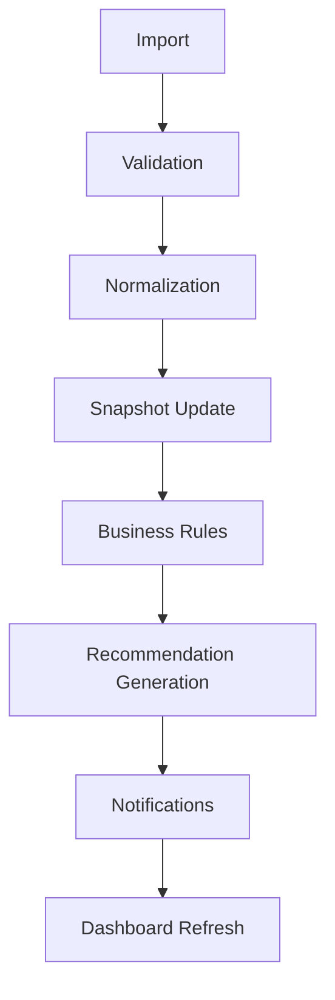

# Event-Driven Processing (Conceptual)

**Version:** 0.1
**Status:** Discovery / Architectural Guidance Only
**Owner:** Engineering
**Last Updated:** 2026-08-04

## Purpose

Describe the conceptual workflow by which a single import eventually results in an updated dashboard, viewed through an event-oriented lens: each stage's completion is what allows the next stage to begin. This document does not select a message queue, event bus, background-job system, or any other specific technology. It restates the pipeline already established in [`docs/imports/01-import-framework.md`](../imports/01-import-framework.md) and [`docs/architecture/canonical-data-principles.md`](../architecture/canonical-data-principles.md), extended to name the steps between "Business Rules" and "Dashboard" that those documents did not previously break out: Snapshot Update, Recommendation Generation, Notifications, and Dashboard Refresh.

## Important Clarification

**This is architectural guidance only.** It describes a conceptual sequence of triggers and effects, useful for reasoning about what must happen before what. It does not commit LabPulse to:

- Any specific event bus, message queue, or pub/sub technology
- Synchronous versus asynchronous execution of any stage
- Real-time versus batch/scheduled processing
- Any particular notification delivery mechanism (email, in-app, push)

Those are Sprint 2+ (or later) implementation decisions, out of scope here.

## Conceptual Workflow

```text
Import
  ↓
Validation
  ↓
Normalization
  ↓
Snapshot Update
  ↓
Business Rules
  ↓
Recommendation Generation
  ↓
Notifications
  ↓
Dashboard Refresh
```



### Import

A source file is uploaded and treated as untrusted, per [`docs/security/01-security-requirements.md`](../security/01-security-requirements.md). See [`docs/entities/import-job.md`](../entities/import-job.md).

### Validation

The import is checked against its [ImportProfile](../entities/import-profile.md)'s structural, type, and business rules, per [`docs/imports/05-import-validation.md`](../imports/05-import-validation.md).

### Normalization

Validated rows are mapped into the Canonical LabPulse Data Model, per [`docs/imports/04-data-normalization.md`](../imports/04-data-normalization.md).

### Snapshot Update

Normalized data is written into the relevant canonical snapshot entities — [RevenueSnapshot](../entities/revenue-snapshot.md), [PayrollSnapshot](../entities/payroll-snapshot.md), [LaborModelSnapshot](../entities/labor-model-snapshot.md), [BacklogSnapshot](../entities/backlog-snapshot.md), and, once defined, [ProductionSnapshot](../entities/production-snapshot.md), [QualitySnapshot](../entities/quality-snapshot.md), [CareerGridSnapshot](../entities/career-grid-snapshot.md), and [RecruitingSnapshot](../entities/recruiting-snapshot.md). This is the step at which "new data exists" becomes true for a given office and period — conceptually, the point that would emit an event meaning "this office's data changed" if an event-driven implementation were chosen later.

### Business Rules

Rules such as [BR-001](../business/rules/BR-001-prioritize-location-review.md) through [BR-006](../business/rules/BR-006-staffing-adherence.md) evaluate the updated snapshots and any other canonical data they depend on, producing [Alert](../entities/alert.md) records where a threshold or condition is met. See [`docs/architecture/decision-graph.md`](decision-graph.md) for which metrics feed which rules.

### Recommendation Generation

Recommendation rules ([BR-002](../business/rules/BR-002-hiring-recommendation.md), [BR-005](../business/rules/BR-005-lss-recommendation.md), and future types) synthesize Alerts and other signals into [Recommendation](../entities/recommendation.md) records in the **Generated** state, per [`docs/architecture/recommendation-framework.md`](recommendation-framework.md).

### Notifications

A manager (or other relevant [User](../entities/user.md)) is informed that a new Alert or Recommendation exists. This conceptual step is where a Recommendation would typically move from **Generated** to **Presented** (see [`docs/architecture/recommendation-framework.md`](recommendation-framework.md) Lifecycle). No delivery mechanism is chosen here.

### Dashboard Refresh

The dashboard reflects the updated snapshots, alerts, and recommendations the next time it is viewed (or, in a future real-time implementation, immediately). See [`docs/architecture/01-system-architecture.md`](01-system-architecture.md) Aggregation Strategy, which is itself still provisional.

## Why Name These Steps Explicitly

[`docs/imports/01-import-framework.md`](../imports/01-import-framework.md) and [`docs/architecture/canonical-data-principles.md`](canonical-data-principles.md) describe the pipeline from Import through Business Rules to the Scenario Engine and Presentation Layer, but treat everything from "Business Rules" to "Dashboard" as one step. As [BR-002](../business/rules/BR-002-hiring-recommendation.md) and [BR-005](../business/rules/BR-005-lss-recommendation.md) (recommendation-producing rules, distinct from detection rules) and the immutable Recommendation lifecycle ([`docs/architecture/recommendation-framework.md`](recommendation-framework.md)) have been formalized, it became necessary to name Recommendation Generation and Notifications as distinct conceptual steps, so future implementation discussions have a shared vocabulary for "when does a manager actually find out about this."

## Relationship to Other Pipeline Documents

This document does not compete with or duplicate:

- [`docs/imports/01-import-framework.md`](../imports/01-import-framework.md) — the authoritative Import → Import Profile → Validation → Normalization → Canonical Data Model → Business Rules → Scenario Engine → Dashboard pipeline
- [`docs/architecture/canonical-data-principles.md`](canonical-data-principles.md) — why every stage depends on canonical objects, not source layouts

It elaborates the segment of that same pipeline from Business Rules onward, adding the Snapshot Update, Recommendation Generation, Notifications, and Dashboard Refresh vocabulary, and reframes the whole sequence as a chain of triggers for reasoning about eventual event-driven implementation.

## What This Document Does Not Define

- Any specific technology choice (queue, event bus, cron, webhooks, or otherwise)
- Retry, failure, or idempotency behavior for any stage
- Real-time vs. batch cadence for Snapshot Update or Dashboard Refresh
- Notification content, channel, or delivery guarantees

## Related Documents

- [Import Framework](../imports/01-import-framework.md)
- [Canonical Data Principles](canonical-data-principles.md)
- [Recommendation Framework](recommendation-framework.md)
- [Decision Graph](decision-graph.md)
- [ADR-000: Architectural Philosophy](../decisions/ADR-000-architectural-philosophy.md)
