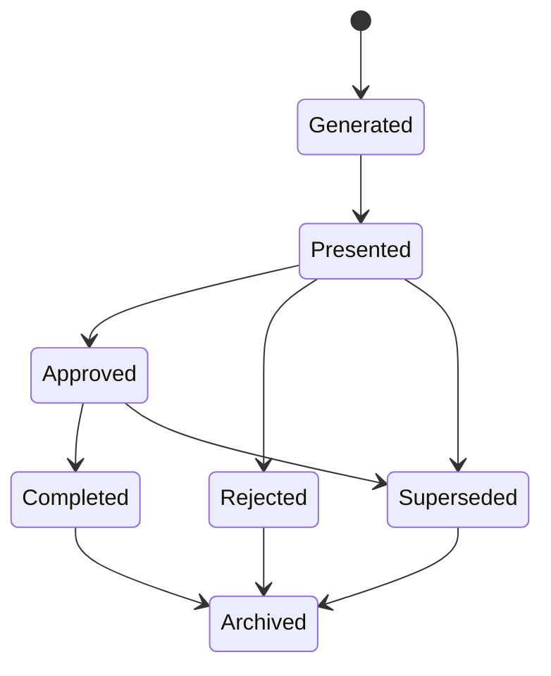

# Recommendation Framework

**Version:** 0.1
**Status:** Discovery / Platform Design
**Owner:** Engineering / Lab Operations
**Last Updated:** 2026-08-04

## Purpose

Define one standard recommendation structure that every recommendation type — Hiring, LSS, Transfer, Coaching, Travel, Budget, and any future type — inherits, so the platform never has to invent a new explanation format per feature. This document defines structure and lifecycle only. No formulas or scoring weights are defined here.

## Why a Common Structure

[BR-001](../business/rules/BR-001-prioritize-location-review.md) and its successors ([BR-002](../business/rules/BR-002-hiring-recommendation.md) through [BR-006](../business/rules/BR-006-staffing-adherence.md)) each produce recommendations for manager review, and [`docs/product/01-product-vision.md`](../product/01-product-vision.md) describes a general Recommendation Engine spanning hiring, transfers, coaching, travel, and budget decisions. Without a shared structure, each recommendation type would re-invent its own explanation shape, undermining the Explainability principle in [`docs/product/00-north-star.md`](../product/00-north-star.md).

## The Standard Recommendation Object

Every recommendation, regardless of type, is built from the same conceptual envelope:

| Field group | Contents |
|---|---|
| **Identity and scope** | Recommendation type, organization, office, reporting period |
| **Status** | Current lifecycle state (see below) |
| **Contributing signals** | Which canonical entities, metrics, alerts, and business rules produced this recommendation, with their current values and data freshness |
| **Reasons** | A human-readable explanation of why the recommendation was produced |
| **Assumptions** | Any assumption used to produce the recommendation, shown explicitly rather than buried in the calculation |
| **Rule and framework version** | The business rule version and recommendation-framework version that produced this recommendation |
| **Limitations / confidence** | Known gaps, unresolved thresholds, or data-quality caveats that affect how much weight the recommendation should be given |
| **Suggested next step** | A link to the relevant scenario (see [`docs/scenario-engine/`](../scenario-engine/README.md)) or workflow, where one exists |
| **Resolution** | The manager's decision (Approved or Rejected, per the Lifecycle below) and their reason, once recorded |
| **Audit trail** | Who saw it, what changed, and when (see [`docs/security/01-security-requirements.md`](../security/01-security-requirements.md) Logging and Auditing) |

This structure is conceptual, matching the [Recommendation entity](../entities/recommendation.md) in the entity catalog. It is not a database schema; field types, keys, and storage are Sprint 2 (database design) concerns.

## Type-Specific Extension

A recommendation type may add its own structured detail on top of the common envelope, without changing the envelope itself:

- **Hiring** — proposed role, office context, related scenario ([`docs/scenario-engine/01-hiring.md`](../scenario-engine/01-hiring.md)), see [BR-002](../business/rules/BR-002-hiring-recommendation.md)
- **LSS** — requested support type, related scenario ([`docs/scenario-engine/03-lss-support.md`](../scenario-engine/03-lss-support.md)), see [BR-005](../business/rules/BR-005-lss-recommendation.md)
- **Transfer** — source and destination office, employee/role context (see [`docs/product/01-product-vision.md`](../product/01-product-vision.md) Transfer Analysis; no dedicated business rule exists yet — see Open Questions)
- **Coaching** — manager and topic context (see OQ-036 in [`docs/development/open-questions.md`](../development/open-questions.md); not yet a defined business rule)
- **Travel** — purpose and destination office context (see OQ-037; not yet a defined business rule)
- **Budget** — affected expense category context (relates to [`docs/business/02-payroll-and-expenses.md`](../business/02-payroll-and-expenses.md); not yet a defined business rule)

Every type-specific extension must still populate the full common envelope. A recommendation is never allowed to skip reasons, assumptions, or rule version just because it is a new type.

## Lifecycle

**Recommendations are immutable.** A recommendation record, once created, is never edited in place. Every state change appends a new, timestamped status entry to that recommendation's history; the original Generated record and every prior state remain permanently readable. This is what makes a recommendation auditable and explainable after the fact, per [ADR-000](../decisions/ADR-000-architectural-philosophy.md) ("version everything," "traceability").

### States

- **Generated** — a business rule or the scenario engine produced this recommendation. Nothing about it has been shown to a manager yet.
- **Presented** — the recommendation has been shown to a manager (for example, surfaced in the review queue or a dashboard).
- **Approved** — a manager has decided to proceed, typically by way of a [Scenario](../entities/scenario.md) or a [Task](../entities/task.md).
- **Rejected** — a manager has decided not to proceed and recorded a reason.
- **Completed** — the approved action was carried out and its outcome recorded.
- **Superseded** — newer data or a newer rule evaluation produced an updated recommendation for the same underlying condition before this one reached Completed or Rejected; this recommendation is retained, and the new one references it.
- **Archived** — no longer active (reached Completed, Rejected, or Superseded, and is now retained for history only).

A recommendation never transitions itself into "Approved" — that transition requires a manager action, consistent with the safety controls already established in [BR-001](../business/rules/BR-001-prioritize-location-review.md) ("do not automatically discipline, transfer, hire, terminate, or evaluate an employee"). A rule engine may move a recommendation to "Superseded" automatically when it generates a replacement, but it may never fabricate an "Approved," "Rejected," or "Completed" state.

Historical recommendations are never overwritten. If circumstances change after a recommendation was Approved or Rejected, the correct action is to generate a new recommendation (which may mark the old one Superseded), not to edit the old one's outcome.

## Relationship to Alerts

A [Recommendation](../entities/recommendation.md) is distinct from an [Alert](../entities/alert.md): an Alert reports that a threshold or condition was observed; a Recommendation suggests what a manager might consider doing about it. One Alert may lead to zero, one, or multiple Recommendations (for example, a backlog alert might produce both a Hiring recommendation and an LSS recommendation for the same office and period).

## Relationship to Scenarios

A Recommendation's "suggested next step" typically points to a [Scenario](../entities/scenario.md), where the manager can model the specific proposed action before deciding. The recommendation itself does not perform that modeling — see [`docs/scenario-engine/README.md`](../scenario-engine/README.md).

## Safety

- Recommendations are always framed as suggestions for review, never as decisions already made.
- AI may help phrase the "Reasons" field in plain language but must not alter the underlying contributing signals or invent a reason not backed by an actual rule or metric (see [ADR-003](../decisions/ADR-003-ai-provider-strategy.md)).
- A Rejected recommendation must retain its reasons and the manager's rejection reason for audit purposes, not be deleted — consistent with immutability above.

## What This Document Does Not Define

- Scoring or ranking formulas across recommendation types.
- The concrete database schema for storing recommendations (see [`docs/entities/recommendation.md`](../entities/recommendation.md) for the conceptual entity; SQL design is Sprint 2 work).
- UI presentation of recommendations.

## Related Documents

- [ADR-005: Canonical Data Model](../decisions/ADR-005-canonical-data-model.md)
- [Decision Graph](decision-graph.md)
- [Entity: Recommendation](../entities/recommendation.md)
- [Entity: Alert](../entities/alert.md)
- [BR-001 through BR-006](../business/rules/)
- [Open Questions](../development/open-questions.md)
